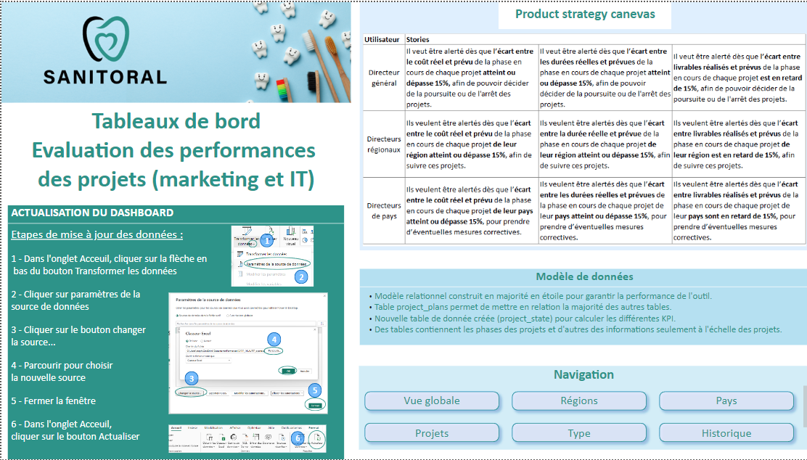

# Créez un tableau de bord dynamique avec PowerBI pour visualiser l'avancement de projets

## Contexte
L'entreprise Sanitoral (fictive) présente à l'international dans 4 régions : Europe occidentale, Europe de
l'Est/Moyen-Orient/Afrique, Amérique du Nord et latine, Asie Pacifique. 

## Objectif
**Construire un tableau de bord afin d’évaluer les performances des différents
projets pour IT et Marketing**

## Outils utilisés
PowerBI
PowerQuery

## Le dashboard
### Page d'accueil

### Vue globale
### Vue régionale
### Vue par pays
### Vue par projet